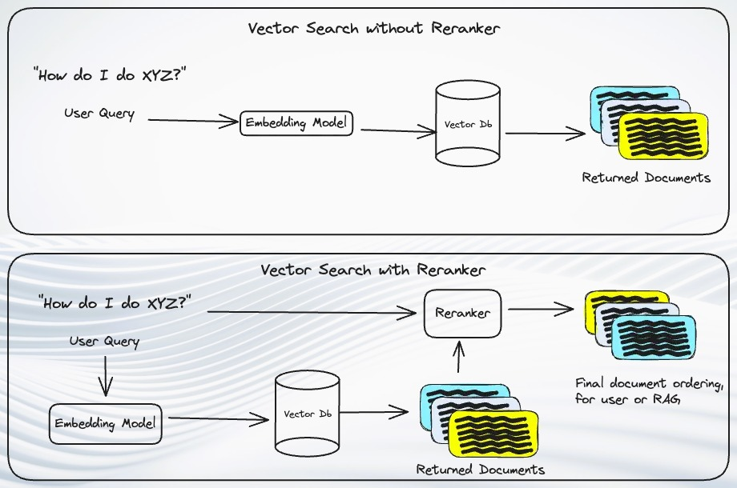

# Retrieval‑Reranker 🚀

Set of Jupyter notebooks to experiment with retrieval and reranking strategies using Qdrant over BEIR / MS‑MARCO datasets.

## 🧠 Overview & Motivation

Searching by keywords isn’t enough when you want *semantic matching*. This project explores a *two-stage retrieval pipeline*:

1. **Dense retrieval**: Represent documents & queries as vectors; use ANN (via Qdrant) to retrieve top candidates  
2. **Reranking**: Use stronger, joint models (e.g. cross‑encoders or sparse models) to reorder those candidates for higher precision

It helps illustrate tradeoffs between **speed / scalability** and **accuracy / relevance**.

---

## 📦 Technologies & Tools Used

- **Qdrant** — vector database (for storing embeddings + ANN search)  
- **Sentence Transformers / Embedding models** for vector generation  
- **Cross‑encoders / MiniCOIL** (or similar) for reranking  
- **Jupyter Notebooks** for experimentation  
- **Evaluation metrics**: nDCG, MRR, MAP, Recall, Precision  

---

## 🛠 Setup & Running

Execute notebooks in this order (or as needed):

   - `dataset_download.ipynb` → fetch and preprocess dataset  
   - `qdrant-test.ipynb` → basic tests with Qdrant  
   - `retriever.ipynb` → embed docs & queries, upsert into Qdrant, retrieve and saves initial retrieval results
   - `reranker.ipynb` → rerank top‑K retrieved docs using stronger model  
   - `eval.ipynb` → compute and compare evaluation metrics  

---

## 📊 Sample Results & Observations

- **Baseline (Dense-only)**: good recall, but ranking might not be optimal  
- **Reranking stage**: ordering top‑K results using cross‑encoder or other models improves nDCG, MRR, MAP  
- **Tradeoff**: adding reranking adds compute cost / latency but yields better precision

You can document actual metric numbers from your experiments in this section (or link to a results notebook/csv).

---

## 📚 References

- MS MARCO / BEIR (retrieval benchmarks)  
- Qdrant documentation  
- Papers on **MiniCOIL**, **ColBERT / Cross‑Encoder** reranking  

---

